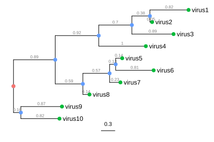

```{r setup, include=FALSE}
knitr::opts_chunk$set(echo = TRUE,comment = NA,eval=FALSE)
```

# Course Aims

-   Import dataframes and create plots
-   Customize plots with themes, colours, and labels
-   Export plots
-   Creating multiple plots and facets
-   Importing phylogenetic tree files
-   Visualize and manipulate phylogenetic trees

# 3. [ggplot2](https://r-graph-gallery.com/ggplot2-package.html)


## 3.1. Drawing your first plot with the mtcars dataset

The 1974 Motor Trend US magazine dataset comprises of 32 observations of automobiles in 11 categories of numeric continuous variables. This dataset in included in R and we can preview the dataframe using the `View` command:

```{r}
library(ggplot2)
View(mtcars)

```

Let us create a scatterplot of the number of cylinders against miles/gallon of the vehicles. To do that, we will feed in our dataframe and map our the aesthetics of interest into our code:

```{r}
ggplot(mtcars, aes(cyl, mpg)) +
  geom_point()

```

We can make a slight adjustment to the x-axis for it to display the values that are in our dataset. To do that, we can convert `cyl` to a factor, that way we are telling ggplot to treat `cyl` as a categorical value:

```{r}
ggplot(mtcars, aes(factor(cyl), mpg)) +
  geom_point()

```

Can you tell the difference in both plots?

## 3.2. Mapping data columns to aesthetics

Having generated our plot, we can add another layer of data to the figure with a different representation. In this case we are going to plot the weight of cars by mpg and colour the scatterplot with displacement values:

```{r}
ggplot(mtcars, aes(wt, mpg, color = disp)) +
  geom_point()

```

We can also visualize the displacement values by sizes, when we map the aesthetics to a continuous size scale:

```{r}
ggplot(mtcars, aes(wt, mpg, size = disp)) +
  geom_point()
  
```

## 3.3. Adding Geometries (Excercise)

One common feature in ggplot2 is to include additional layers of geometrics to your plot. In this exercise, you are expected to explore the`diamonds` dataset just like we did for `mtcars`.

The `diamonds` dataset contains prices for over 50,000 round cut diamonds with 10 variables: price, carat, cut, color, clarity, x, y, z, depth, and table.

In the following chunk of code, type in the command to:

-   View the `diamonds` dataset
-   Plot a scatterplot of the price to carat and colour the points according to clarity
-   Add a smooth trend curve to your plot using `geom_smooth`. **HINT:** You can use the `+` operator to add geometrics to your current plot!

```{r}
# Type below your code to view the diamonds dataset


```

```{r}
# Enter your code to plot the price of diamonds to carat and colour the points according to clarity


```

```{r}
# Type your code to add a smooth trend curve to your previous plot


```

## 3.4. Manipulating Geometrics (Excercise)

We have seen how we can change all the geometrics at once when we have multiple geoms when we map an aesthetic to a data variable within the `ggplot()` command. However, we can also change specific geoms individually, by entering options in the `geom_*()` function. For example, `geom_point()` has an alpha option that controls the opacity of the points, where the value of 1 (default) represents an opaque point, and the value of 0 represent a totally transparent point (invisible). We are going to make the point in your last plot translucent by setting `alpha` to 0.4:

```{r}
# Enter your code below


```

## 3.5. Saving plots as variables

Plots can also be saved as a variable. This is useful when you want to make multiple related plots from a common base. This can be done by joining the variable with the `+` operator to a new geom feature. We can try that with the `mtcars` dataset that was explored earlier on:

```{r}
cars_wt_vs_mpg <- ggplot(mtcars, aes(wt, mpg, size = disp))
cars_wt_vs_mpg + geom_point(color="steelblue")
  
```

## 3.6. Including Multiple Categories

In the event that we want to visualize extra categories in our dataset for context, we can include additional aesthetics to the plot. Here, we would want to colour the points based on number of cylinders in our previous plot:

```{r}
cars_wt_vs_mpg <- ggplot(mtcars, aes(wt, mpg, size = disp))
cars_wt_vs_mpg + geom_point(aes(color=factor(cyl)))

```

## 3.7. Plot Themes and Plot Titles

Another cool feature is that `ggplot2` comes with pre-built themes that allows you to change the background of your plot. Enter `?theme_bw` in your console to see the available built-in themes. Furthermore, we can change the labels on the plot axis, legends, and include titles to the plot using the `labs` function.

```{r}
default_plot <- ggplot(mtcars, aes(wt, mpg, size = hp)) +
  geom_point(aes(color=factor(cyl))) +
  labs(title = "Car weight vs Mileage", x = "Weight", y = " Gas Mileage", size = "Horsepower", color = "# of cylinders")

default_plot + theme_bw() + labs (subtitle = "Black & White Theme")
default_plot + theme_test() + labs (subtitle = "White Theme")
```

## 3.8. Multiple Plots and Faceting

Faceting allows us to split our chart into several small parts or a grid. Each section shows the same graph for a specific group of the dataset. In this example, we will split our previous plot into three small categories grouped by number of cylinders. The default is usually split by columns:

```{r}
ggplot(mtcars , aes(x=wt, y=mpg, color=as.factor(cyl), size = hp)) + 
  geom_point() +  
  facet_wrap(~cyl) +
  labs(title = "Car weight vs Mileage", x = "Weight", y = " Gas Mileage", size = "Horsepower", color = "# of cylinders") +
  theme_test()
```

We can decide to split this facet plot into rows or vertical orientation. For this, we will use the `dir` argument which stands for direction and apply a "vertical (v)" option as seen below:

```{r}
ggplot(mtcars , aes(x=wt, y=mpg, color=as.factor(cyl), size = hp)) + 
  geom_point() +  
  facet_wrap(~cyl, dir = "v") +
  labs(title = "Car weight vs Mileage", x = "Weight", y = " Gas Mileage", size = "Horsepower", color = "# of cylinders") +
  theme_test()
```

Alternatively, we can move the label to the bottom of the plots if we wish to do so:

```{r}
ggplot(mtcars , aes(x=wt, y=mpg, color=as.factor(cyl), size = hp)) + 
  geom_point() +  
  facet_wrap(~cyl, strip.position = "bottom") +
  labs(title = "Car weight vs Mileage", x = "Weight", y = " Gas Mileage", size = "Horsepower", color = "# of cylinders") +
  theme_test()
```

Finally, we can modify the number of rows and columns to our preference. To make the facet plot have only two columns, we can make a small change to our code:

```{r}
ggplot(mtcars , aes(x=wt, y=mpg, color=as.factor(cyl), size = hp)) + 
  geom_point() +  
  facet_wrap(~cyl, ncol = 2) +
  labs(title = "Car weight vs Mileage", x = "Weight", y = " Gas Mileage", size = "Horsepower", color = "# of cylinders") +
  theme_test()
```

## 3.9. Exporting Plots

`ggsave` is a function of `ggplot2` that allows you to export your plot to your disk in any of the following formats: eps, ps, tex, pdf, jpeg, tiff, png, bmp, svg, or wmf. In this example, we will save our last plot as a pdf file on our computer:

```{r}
ggsave(
  "facet.plot1.pdf",
  plot = last_plot(),
  device = "pdf",
  path = "/home/idowu/Downloads/",
  scale = 1,
  width = 20,
  height = 10,
  units = "cm",
  dpi = 300,
  limitsize = TRUE,
  bg = NULL
)

```

## 3.10. Other Plots

We have only explored scatterplots all through this tutorial. However, `ggplot2` can also render boxplots, histograms, density plots, and many more. For the sake of the scope, we will only cover: boxplots and density plots.

### 3.10.1. Boxplots

The geometric function for bar charts in `ggplot2` is geom_boxplot(). We can use this to get a visual representation of how our data is spread out. It also provides some indication of the data's symmentary and outliers. To use the `mtcars` dataset, run the following to plot the number of cylinders against the gas mileage using a boxplot:

```{r}
ggplot(mtcars, aes(x=factor(cyl), y = mpg)) +
  geom_boxplot(color='blue', fill="skyblue") +
  labs(x = "# of cylinders", y = "Gas Mileage") +
  theme_test()


```

Here we can easily see the median value, lower quartile, and upper quartile of gas mileage per number of cylinders using this representation.

### 3.10.2. Density Plots

The geometric function for bar charts in `ggplot2` is geom_density(). This plot can produce a representation of the distribution of our data like the boxplot but with the proportion of values in each range. We are still going to make use of the `mtcars` dataset but then look at the distribution of mpg in each cylinder type vehicles.

```{r}
ggplot(mtcars, aes(mpg)) +
  geom_density(aes(fill=factor(cyl)), alpha=0.8) +
  labs(x = "Gas Mileage", y = "Density", fill = "# of cylinders") +
  theme_test()


```

To change the colour to our desired palette, we can run the following:

```{r}
p <- ggplot(mtcars, aes(mpg)) +
  geom_density(aes(fill=factor(cyl)), alpha=0.8) +
  labs(x = "Gas Mileage", y = "Density", fill = "# of cylinders") +
  theme_test()

p + scale_fill_manual(values=c("red3", "gold", "skyblue"))

```

## Excercise 1

Create a facet of density plots showing gears per horsepower using the `mtcars` dataset and export it as a PDF file: Enter code below:

```{r}


```

## BONUS!

ggtree2 comes with a cheat sheet where you can see the variety of geometric functions and the kind of plots they render: [cheat_sheet](https://github.com/rstudio/cheatsheets/blob/main/data-visualization-2.1.pdf)

# ggtree


'ggtree' extends the 'ggplot2' plotting system which implemented the grammar of graphics. 'ggtree' is designed for visualization and annotation of phylogenetic trees and other tree-like structures with their annotation data.

Installing and loading library functions:

```{r}
if (!require("BiocManager", quietly = TRUE))
    install.packages("BiocManager")

BiocManager::install("ggtree")
BiocManager::install("treeio")
library("ggtree")
library("treeio")

```

## 3.11. Phylogenetic Tree: Overview

Phylogenetic trees are used to describe genealogical relationships among a group of organisms, which can be constructed based on the genetic sequences of the organisms. A rooted phylogenetic tree represents a model of evolutionary history depicted by ancestor-descendant relationships between tree nodes and clustering of ‘sister’ or ‘cousin’ organisms at a different level of relatedness, as illustrated

 


External nodes (green circles), also called tree tips represent actual organisms sampled/sequenced (viruses in this context).The internal nodes (blue circle) represent the hypothetical ancestor of the tips. The root (red tip) is the common ancestor of all the organisms in the tree. The horizontal lines are the branches and illustrate the evolutionary changes and the gray number measured in a unit of genetic divergence or time. Finally, the bar at the bottom with the number indicates the scale of the branch lengths.

## 3.12. Phylogenetic Visualization

To visualize your tree, you can simply read the treefile using `treeio` to parse the file. In this example, we will be using the vignette or data that comes with the `treeio` package:

```{r}
tree <- read.tree(system.file("extdata", "sample.nwk", package = "treeio"))
ggtree(tree)

```

Hooray!!! You have visualized your first tree in R! However, you would notice that by default the tree tips are not shown. To display them, run the following:

```{r}
ggtree(tree) + geom_tiplab()

# A little trick to change the orientation of the tree 
ggtree(tree, ladderize = FALSE) + geom_tiplab()

# We can also colour the branches
ggtree(tree, color="red2") + geom_tiplab()

# If you are interested in a cladogram that has no branch length information
ggtree(tree, branch.length = "none") + geom_tiplab()

```

## 3.13. Phylogenetic Tree Layouts

ggtree allows you to adjust the presentation of your tree as you like and there are lots of ways to do that. The default layout is a rectangular one as we saw previously, but here are a few examples:

```{r}
ggtree(tree) + labs(title="rectangular")
ggtree(tree, layout="roundrect") + labs(title="round rectangular")
ggtree(tree, layout="ellipse") + labs(title="ellipse")
ggtree(tree, layout="circular") + labs(title="circular")
ggtree(tree, layout="fan", open.angle=120) + labs(title="fan")

```

Additional layouts that can be achieved by modifying the coordination of the tree:

```{r}
ggtree(tree) + scale_x_reverse() + geom_tiplab(hjust=1)
ggtree(tree) + coord_flip() + geom_tiplab(vjust = -0.5, hjust = 0.5)
ggtree(tree) + layout_dendrogram() + geom_tiplab(vjust = 1, hjust = 0.5)

```

```{r}
ggtree(tree) + 
    geom_tippoint(shape=20, size=3, color="purple")

```

## BONUS: Point Shape Options in ggplot2

Shapes are interesting ways of customizing our plots and unfortunately they aren't well documented in R. However, there is a blog that best describes how to maneuver this function thereby saving you lots of time and stress: [Albert's blog](https://blog.albertkuo.me/post/point-shape-options-in-ggplot/) is a good resource you might want to check out to know how to use this fun customizations in your plots!

## 3.14. Getting Internal Nodes and Labelling Clades

One important way of making your tree visually appealing is to label a clade of organisms that share a hypothetical ancestor. This allows us to present our data in a clearer way. To do that, we would need to display the internal nodes in our tree. Thereby, we can label clades based on the node information that they have in common. In this example, we will try to label all isolates that share node 16 (A, B, C, D, E, F, G, and H) as Clade 1, and isolates that share node 23 (J, K, L, and I)as Clade 2.

```{r}
# Display internal nodes
ggtree(tree) + geom_text(aes(label=node), hjust=-.3)

# Label clades using node information
ggtree(tree) + geom_tippoint(shape=20, size=3, color="purple") +
  geom_tiplab() + geom_cladelab(node = 16, label = "Clade 1", color = 'red', offset = .8) +
  geom_cladelab(node=23, label = "Clade 2", color="blue", offset = .8, align=TRUE)

```

## Excercise 2

Create a phylogeny with the following aesthetic characteristics:

-   tips labeled in red
-   red-colored diamond-shape tip points (hint: Google search “R point characters”)
-   large semitransparent yellow node points (hint: geom_nodepoint & alpha=)
-   Add a title to your plot

```{r}


```
